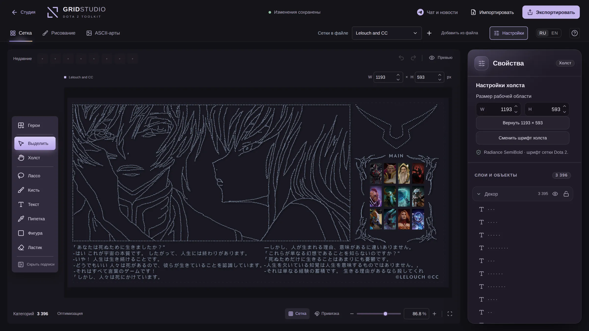
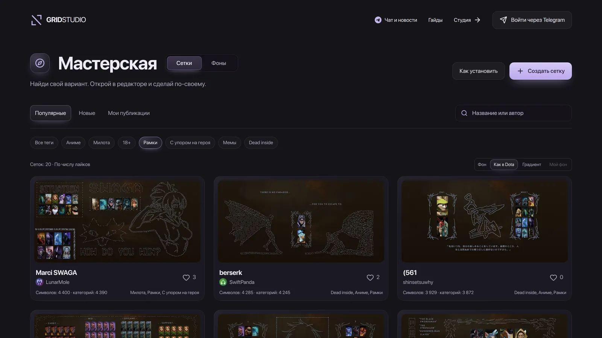
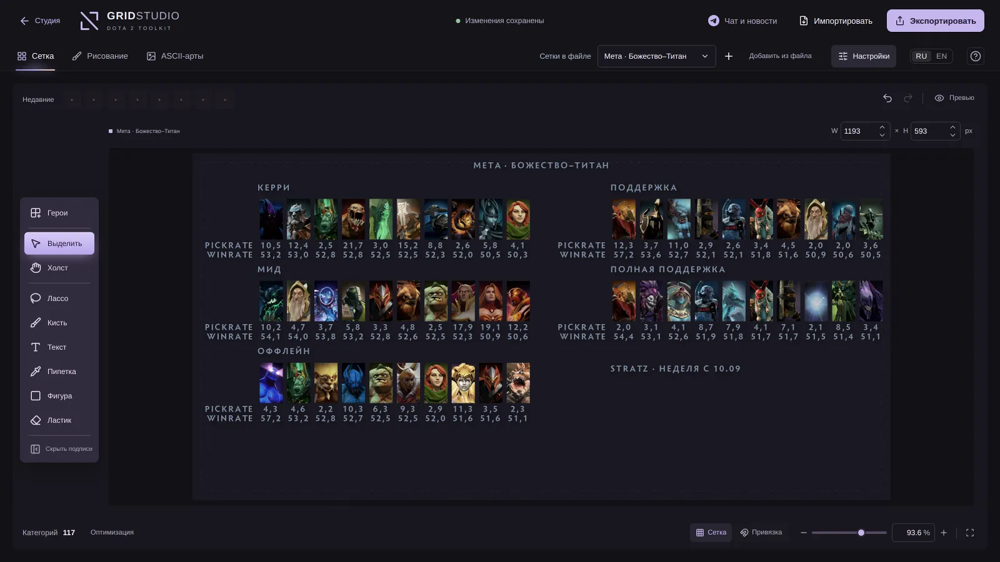
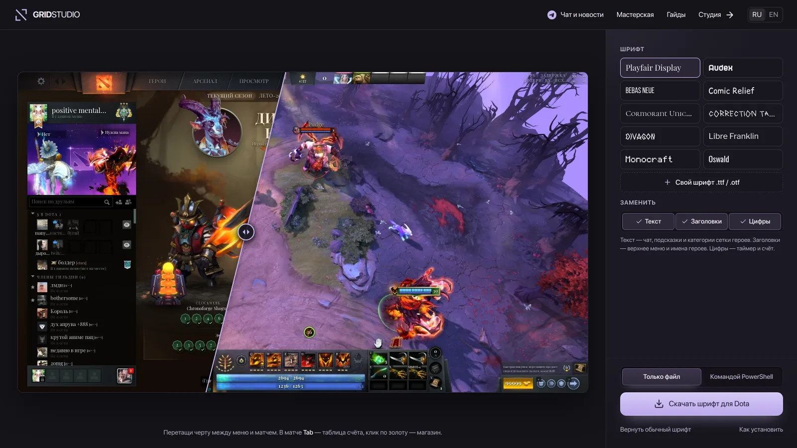
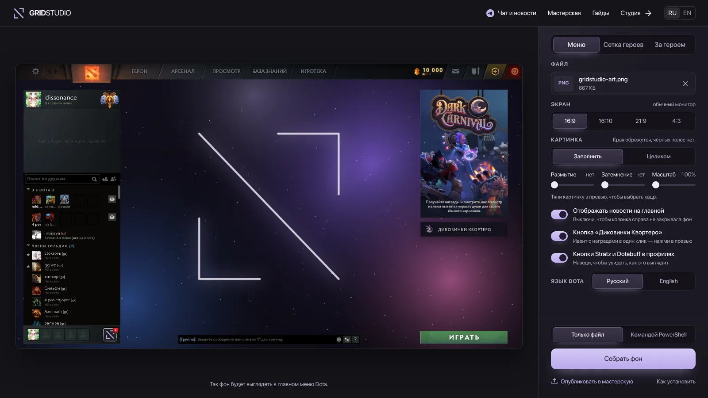

<p align="center">
  <a href="https://gridstudio.me/editor">
    
  </a>
</p>
<p align="center"><sub>На скриншоте — сетка <a href="https://gridstudio.me/workshop?id=a24f127f-0ea2-41dd-9453-906e0c0a66dd">«Lelouch and CC»</a> от anesthesia из мастерской.</sub></p>

<h1 align="center">GridStudio</h1>

<p align="center">Настрой Dota 2 под себя: сетки героев, фоны главного меню и шрифты.</p>

<p align="center">
  <a href="https://gridstudio.me"></a>
  <a href="https://t.me/+VcbLXeqh4EhiMWJi"></a>
  <a href="https://t.me/linsissya"></a>
  <a href="https://www.donationalerts.com/r/linsiss"></a>
</p>
<p align="center">
  <a href="https://gridstudio.me"></a>
  <a href="CHANGELOG.md"></a>
  <a href="https://github.com/linsisss/dota2-grid-toolkit/commits/main"></a>
</p>

## Для пользователей

**[GridStudio](https://gridstudio.me)** — сайт, на котором можно собрать свою сетку героев, фон главного меню и шрифт Dota 2, используя встроенные инструменты и своё воображение. Устанавливать программы и регистрироваться не нужно.

- **Расставляй героев.** Создавай группы, меняй размер портретов и их порядок перетаскиванием. Поиск и фильтры по атрибутам помогают собрать свой пул.
- **Собери сетку по мете.** Шаблон «По мете» ставит на каждую позицию сильных героев за последнюю неделю — с пикрейтом и винрейтом под каждым, для выбранного ранга. Данные — [STRATZ](https://stratz.com).
- **Рисуй символами.** Кисти, фигуры, рамки, текст, слои и подложка для обводки. «Изображение в ASCII» превращает картинку в рисунок: лента стилей сразу показывает её в каждом из 14 стилей.
- **Сетка стоит в игре на месте.** Превью — на фоне экрана героев Dota или своего фона меню. Скачанный файл выглядит одинаково на странице «Герои» и на экране выбора героя, при любом разрешении, и не мешает выбирать героев кликом.
- **Собери фон главного меню.** Своя картинка, GIF или видео превращаются в готовый файл для Dota прямо в браузере: превью настоящего меню для 16:9, 16:10, 21:9 и 4:3, размытие, затемнение, отрезок видео и плавная склейка.
- **Поставь свой шрифт.** Десять бесплатных шрифтов с русскими буквами или свой .ttf/.otf. Превью — на настоящих экранах игры: главное меню и матч с таблицей счёта и магазином.
- **Ставь одной командой.** Сетку, фон и шрифт можно поставить файлом вручную или командой PowerShell (Windows): она сама найдёт Dota и нужную папку, сохранит прежние файлы и вернёт их второй командой.
- **Всё в «Студии».** Сетки и фоны в одном месте. Изменения сохраняются в браузере; по нажатию на «Изменения сохранены» открываются резервные версии. Вход через Telegram добавляет синхронизацию с аккаунтом.
- **Делись работами.** Публикуй сетки и фоны в мастерской после проверки, скачивай чужие или открывай их у себя. Публикация доступна без входа; для лайков и изменения опубликованных работ нужен Telegram.
- **Профиль автора.** Ник, аватарка, описание и значки, все работы и сколько лайков они собрали. На автора можно подписаться — бот пришлёт его новые сетки. «Понравилось» собирает всё с твоим лайком в одном месте.
- **Читай и пиши гайды.** [Гайды](https://gridstudio.me/guides) — как оформить профиль, минипрофиль и не только, с картинками, видео и файлами. Писать можно после входа через Telegram, каждый гайд проверяет модератор; под гайдами — лайки и комментарии.
- **Разберёшься за минуту.** При первом открытии редактор показывает, где что; пройти обучение ещё раз — «Помощь» → «Обучение». Сайт есть на русском и английском.
- **Нашёл баг или есть идея?** Пиши в [чат пользователей](https://t.me/+VcbLXeqh4EhiMWJi), новости — в [канале](https://t.me/linsissya). На сайте это «Чат и новости» в шапке; «Сообщить о баге» сразу копирует справку для разработчиков (версия, браузер, страница, последние сбои).

<table>
  <tr>
    <td width="50%"><a href="https://gridstudio.me/workshop"></a><br /><sub><b>Мастерская</b> — сетки и фоны пользователей</sub></td>
    <td width="50%"><a href="https://gridstudio.me/editor"></a><br /><sub><b>Сетка по мете</b> — сильные герои каждой позиции, данные STRATZ</sub></td>
  </tr>
  <tr>
    <td width="50%"><a href="https://gridstudio.me/background?tab=font"></a><br /><sub><b>Шрифт Dota</b> — превью на экранах меню и матча</sub></td>
    <td width="50%"><a href="https://gridstudio.me/background"></a><br /><sub><b>Фон главного меню</b> — из картинки, GIF или видео</sub></td>
  </tr>
</table>

### Из редактора в Dota 2

Создай сетку или импортируй свой файл. Когда закончишь, нажми **«Экспортировать»** и выбери, как поставить сетку в Dota: **«Файлом вручную»** — `hero_grid_config.json` и пошаговая инструкция с видео; или **«Командой PowerShell»** (Windows) — команда, которую вставляют в PowerShell: она сама найдёт папку аккаунта, открытого сейчас в Steam, положит туда сетку, а прежние сетки сохранит копией. В «Дополнительно» — галочка «Склеивать символы одной линии в строки» (включена: файл в разы легче; без неё каждый символ — отдельная категория) и файл проекта.

| Что скачать | Для чего |
| --- | --- |
| `hero_grid_config.json` | Готовый файл для игры со всеми сетками текущего рабочего пространства. |
| `*.gridstudio.json` | Проект для дальнейшего редактирования: объекты, слои, подложки и сетки. «Экспортировать» → «Дополнительно» → «Файл проекта GridStudio» → «Сохранить». |

<details>
<summary><strong>Куда положить файл в игре</strong></summary>

1. Закрой Dota 2 и сохрани копию своего прежнего `hero_grid_config.json`.
2. Открой папку:

   ```text
   C:\Program Files (x86)\Steam\userdata\ID АККАУНТА\570\remote\cfg
   ```

   **ID АККАУНТА** — ID из Dota 2 или код друга в Steam. В окне экспорта можно вставить ссылку на Steam-профиль и получить готовый путь. Если Steam установлен в другом месте, замени начало пути.
3. Помести скачанный `hero_grid_config.json` в эту папку, запусти игру и выбери сетку в разделе героев.

Чтобы не потерять другие игровые сетки, сначала импортируй существующий файл и добавь новую сетку к нему.

</details>

> Сохраняй JSON проекта перед очисткой данных браузера или сменой устройства. Игровой шрифт может отображать некоторые символы иначе; большое число категорий влияет на производительность Dota 2.

### Фон главного меню

Открой **[gridstudio.me/background](https://gridstudio.me/background)**, перетащи картинку, GIF или видео (до 50 МБ), выбери свой экран и настрой вид. Нажми «Собрать фон», затем «Скачать» — получишь `pak02_dir.vpk`. Всё собирается прямо в браузере, файл никуда не загружается.

<details>
<summary><strong>Куда положить файл</strong></summary>

1. Положи `pak02_dir.vpk` в папку `Steam\steamapps\common\dota 2 beta\game\dota_russian` (нет такой — создай). Лежащий там `pak01_dir.vpk` — русская озвучка, его не трогай.
2. Если озвучка в игре не русская, поставь в настройках Dota русский язык озвучки: моды Dota читает только из папки языка озвучки. У английской Dota интерфейс останется английским, а герои без русского пакета озвучки — с английскими голосами. Параметр запуска `-language` (кроме `-language russian`) убери.
3. Запусти Dota 2.

«Командой PowerShell» скачивает фон и сразу даёт команду: вставь её в PowerShell, и она сама найдёт скачанный файл и Dota, положит фон и поставит русский язык озвучки; вторая команда убирает фон и возвращает всё как было. Изменение файлов игры формально не разрешено правилами Steam, но банов за фоны меню не известно; всё возвращается проверкой целостности файлов в Steam. Подробнее — на странице сборщика и в [docs/customize.md](docs/customize.md).

</details>

### Шрифт Dota

Открой **[gridstudio.me/background?tab=font](https://gridstudio.me/background?tab=font)**, выбери шрифт из каталога или загрузи свой .ttf/.otf и посмотри его на экранах игры. Можно заменить только текст, заголовки или цифры. «Скачать шрифт для Dota» даёт архив со шрифтами и инструкцией внутри; «Командой PowerShell» — архив и команду, которая поставит его сама.

<details>
<summary><strong>Как поставить вручную и как вернуть</strong></summary>

1. Закрой Dota 2.
2. В Steam: Dota 2 → «Свойства» → «Установленные файлы» → «Обзор».
3. Открой `game\dota\panorama\fonts` и на всякий случай скопируй эту папку куда-нибудь.
4. Скопируй туда все файлы из папки `fonts` архива с заменой. Удалять ничего не нужно.
5. Если есть папка `%TEMP%\fontconfig`, удали её, и запусти Dota 2.

Вернуть шрифты Dota: второй командой PowerShell со страницы («Вернуть обычный шрифт») или проверкой целостности файлов в Steam. После больших обновлений Steam может вернуть шрифты Dota — тогда поставь шрифт ещё раз. Все шрифты каталога — бесплатные, под лицензией OFL.

</details>

## Самостоятельный запуск

**Node.js 22.19+**, npm и Git. Интерфейс — React + Vite; мастерская и аккаунты — Node.js + SQLite; вход и модерация — Telegram-бот на puregram. ALTCHA работает на своём сервере, без ключей сторонней CAPTCHA.

### Локально

```sh
git clone https://github.com/linsisss/dota2-grid-toolkit.git
cd dota2-grid-toolkit
npm ci
npm run catalog:setup
npm run dev
```

Открой **[127.0.0.1:4173](http://127.0.0.1:4173)**. Команда запускает интерфейс и API. `catalog:setup` создаёт `.env.catalog.local` с локальными настройками и случайным секретом; существующий файл не перезаписывается. Telegram-бот запускается отдельно, когда он настроен.

### На своём сервере

1. Установи зависимости через `npm ci`. Настрой `.env.catalog.local` по примеру ниже. Замени домен, бота, чат и топик своими значениями:

   ```dotenv
   CATALOG_ORIGIN=https://grid.example.com
   CATALOG_SECRET=YOUR_RANDOM_SECRET_AT_LEAST_32_CHARACTERS
   CATALOG_DB=/var/lib/gridstudio/catalog.sqlite
   CATALOG_TRUST_PROXY=loopback
   CATALOG_ADMIN_TELEGRAM_IDS=123456789,987654321
   CATALOG_TELEGRAM_BOT_TOKEN=YOUR_BOT_TOKEN
   CATALOG_TELEGRAM_BOT_USERNAME=your_grid_bot
   CATALOG_TELEGRAM_CHAT_ID=-1001234567890
   CATALOG_TELEGRAM_TOPIC_ID=2
   # Необязательно: папка видео фонов меню (по умолчанию backgrounds/ рядом с базой)
   # и Telegram ID авторов без суточного лимита публикаций.
   # CATALOG_MEDIA=/var/lib/gridstudio/backgrounds
   # CATALOG_UNLIMITED_TELEGRAM_IDS=123456789
   # Ключ STRATZ для шаблона «По мете» (без него мета отвечает 503).
   # STRATZ_API_TOKEN=YOUR_STRATZ_TOKEN
   ```

   Секрет можно создать командой `node -e "console.log(require('node:crypto').randomBytes(32).toString('hex'))"`. Убери `CATALOG_DEV=1`, если файл был создан для локальной разработки. API и бот должны использовать одну базу и одинаковые настройки.

2. Выполни `npm run build`. Настрой HTTPS и веб-сервер: каталог `dist/` — корень сайта, `/editor` отдаёт `editor.html`, `/workshop` — `catalog.html`, `/background` — `customize.html`, `/guides` — `guides.html`, `/api/catalog/` проксируется на `http://127.0.0.1:4174` с сохранением полного пути. Для фонов меню в мастерской на сервере нужен FFmpeg (`ffprobe` и `ffmpeg`): API проверяет присланные видео и сравнивает их с уже опубликованными.

3. Запусти **два постоянных процесса** из корня проекта через systemd или другой менеджер:

   ```sh
   npm run catalog:serve
   npm run catalog:bot
   ```

   Это отдельные процессы: первый обслуживает API, второй — вход и очередь модерации. Боту нужны права администратора в Telegram-форуме. Решение о публикации может принять любой участник этого чата. Один токен — один polling-процесс.

4. Храни SQLite и папку фонов вне `dist/` и сменяемых папок релизов, предоставь процессам право записи в их каталог. Сохрани на сервере исходники `server/`, `scripts/`, `assets/`, зависимости и `package.json`: одного `dist/` для API и бота недостаточно. Настрой резервное копирование базы и сохраняй `CATALOG_SECRET` при обновлениях.

<details>
<summary><strong>Маршруты для Nginx</strong></summary>

Добавь в HTTPS-блок `server` своего домена. Пути и TLS-сертификат зависят от твоей установки.

```nginx
root /srv/gridstudio/dist;
index index.html;

# JSON сеток сжимается в 15–20 раз, сборка JS/CSS — в 3–5.
gzip on;
gzip_vary on;
gzip_proxied any;
gzip_min_length 1024;
gzip_types application/json application/javascript text/css image/svg+xml;

location = /editor { try_files /editor.html =404; }
location = /workshop { try_files /catalog.html =404; }
location = /background { try_files /customize.html =404; }
location = /guides { try_files /guides.html =404; }
location = /editor/ { return 308 /editor$is_args$args; }
location = /workshop/ { return 308 /workshop$is_args$args; }
location = /background/ { return 308 /background$is_args$args; }
location = /guides/ { return 308 /guides$is_args$args; }
# До 1.5 мастерская называлась каталогом: старые ссылки ведут туда же, #hash браузер сохраняет сам.
location = /catalog { return 301 /workshop$is_args$args; }
# До 1.6.3 сборщик фона был /customize.
location ~ ^/customize/?$ { return 301 /background$is_args$args; }
location = /catalog/ { return 301 /workshop$is_args$args; }

location /api/catalog/ {
    client_max_body_size 9m;
    proxy_pass http://127.0.0.1:4174;
    proxy_set_header Host $host;
    proxy_set_header X-Forwarded-For $remote_addr;
    proxy_set_header X-Forwarded-Proto $scheme;
}

# Фоны меню приходят в мастерскую видеофайлом до 16 МБ с обложкой.
location = /api/catalog/backgrounds {
    client_max_body_size 18m;
    proxy_pass http://127.0.0.1:4174;
    proxy_set_header Host $host;
    proxy_set_header X-Forwarded-For $remote_addr;
    proxy_set_header X-Forwarded-Proto $scheme;
}

location / {
    try_files $uri $uri/ =404;
    add_header Cache-Control "no-cache";
}
```

Лимит 9 МБ нужен для личных файлов, 18 МБ — для фонов меню; API отдельно ограничивает размер публичных заявок. Не добавляй `Cache-Control` в `location /api/catalog/`: API сам запрещает кэш, кроме неизменяемых сеток каталога. `CATALOG_TRUST_PROXY=loopback` используй только с локальным proxy, который перезаписывает `X-Forwarded-For`, как в примере.

</details>

Секреты и базу не помещай в web root или Git. Подробности: [мастерская и модерация](docs/catalog.md), [аккаунты, профили и файлы](docs/accounts-workspaces.md), [гайды](docs/guides.md), [сохранения и восстановление](docs/project-storage.md), [фон главного меню](docs/customize.md), [экран выбора героя и оптимизация](docs/zoom-and-optimization.md).

**Только редактор и сборщик фона:** `dist/` можно разместить на статическом хостинге; без API не будут работать мастерская, вход и синхронизация. В этом репозитории GitHub Pages отведён под [страницу перехода на gridstudio.me](github-pages/index.html). Workflow `Deploy GitHub Pages` публикует только её, по ручному запуску.

### Работа с кодом

```sh
npm run check
npm test
```

[Архитектура](docs/architecture.md) · [Импорт и экспорт](docs/import-and-export.md) · [Переводы](docs/i18n.md) · [История изменений](CHANGELOG.md) · [Порядок выпуска](docs/releases.md)

---

Авторы: **[@linsissya](https://t.me/linsissya)** & **[@dissonance](https://t.me/dissonance)**. Проект вырос из [Dota 2 Grid Toolkit](https://github.com/linsisss/dota2-grid-toolkit); прежние инструменты сохранены в [`tools/`](tools/).

### Лицензия

© 2026 линсис и авторы GridStudio. Код распространяется по лицензии [GNU GPL версии 3](LICENSE) (GPL-3.0-only): его можно использовать, изменять и распространять, в том числе в своих проектах, если они тоже открыты под GPL-3.0 и с исходным кодом. Версии до 1.7.1 включительно вышли под MIT и для тех копий остаются под MIT.

Дополнительное условие по пункту 7(b) GPL-3.0: если вы используете код из этого репозитория или его части, укажите авторство там, где они используются, — в описании проекта или страницы, в README, в комментарии рядом с кодом. Достаточно строки вида: «Использовано из GridStudio — https://gridstudio.me, https://github.com/linsisss/dota2-grid-toolkit». Будем рады такой строке и тогда, когда вы берёте с сайта идеи или алгоритмы.

Сторонние части сохраняют свои лицензии: иконки Lucide (ISC) и Simple Icons (CC0), иконки монет Web3 Icons (MIT), шрифты FIGlet (figlet.js, MIT), шрифты каталога «Шрифт Dota» (SIL OFL 1.1) — источники указаны в комментариях к коду и в [assets/ATTRIBUTION.md](assets/ATTRIBUTION.md). Ресурсы и шрифты Dota 2 принадлежат своим правообладателям и не входят в эту лицензию. GridStudio — проект сообщества, не официальный продукт Valve.
